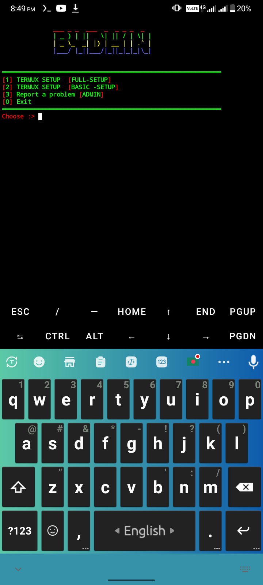

# SET-UP
TERMUX SET UP ON YOUR TOOS🥰
# RUN This Command 👇
       git clone https://github.com/B4DH1N-404-CYBER/SET-UP/tree/main
       cd SET-UP
       ls
       python B4DH1N-new-enc.py

#PROVE 👇

